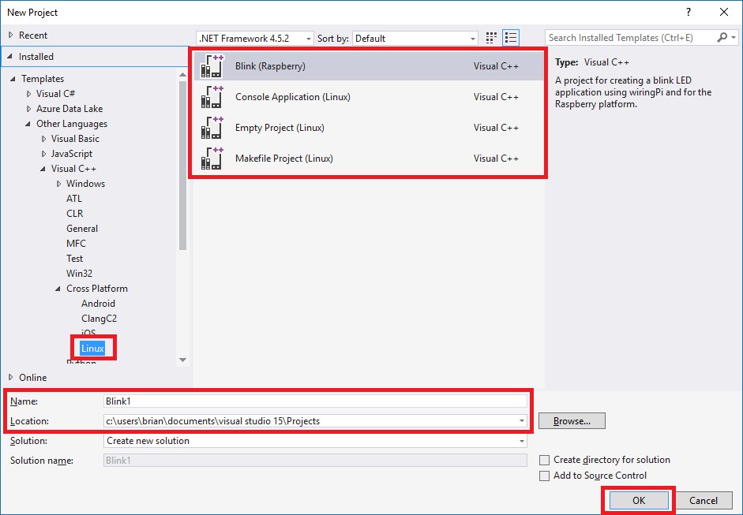

# Create a New Linux Project

To work with a Linux project, the first thing you will need to do is create a new project in Visual Studio.

1. Select **File > New Project** in Visual Studio, or press **Ctrl + Shift + N**.
1. Select the **Templates > Other Languages > Visual C++ > Cross Platform > Linux** node and then select the project type you would like to create, enter a Name/Location, and click OK.

   

   | Project Type | Description
   | ------------ | ---
   | **Blink (Raspberry)**           | Creates a project targeted for a Raspberry Pi device with sample code written to blink an LED
   | **Console Application (Linux)** | Creates a project targeted for any Linux computer with sample code written to output text to the console
   | **Empty Project (Linux)**       | Creates a project targeted for any Linux computer with no sample code written
   | **Makefile Project (Linux)**    | Creates a project targeted for any Linux computer which will be built using a standard Makefile build system

<!--HONumber=Jan17_HO2-->

