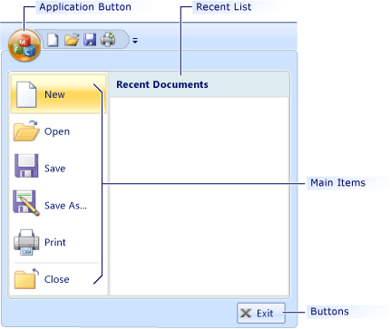

# How to: Customize the Application Button
When you click the Application button, a menu of commands is displayed. Typically, the menu contains file-related commands such as **Open**, **Save**, **Print**, and **Exit**.  
  
   
  
 To customize the Application button, open it in the **Properties** window, modify its properties, and then preview the ribbon control.  
  
### To open the Application button in the Properties window  
  
1.  In Visual Studio, on the **View** menu, click **Resource View**.  
  
2.  In **Resource View**, double-click the ribbon resource to display it on the design surface.  
  
3.  On design surface, right-click the Application button menu and then click **Properties**.  
  
## Application Button Properties  
 The following table defines the properties of the Application button.  
  
|Property|Definition|  
|--------------|----------------|  
|**Buttons**|Contains the collection of up to three buttons that appear in the bottom-right corner of the Application menu.|  
|**Caption**|Specifies the text of the control. Unlike other ribbon elements, the Application button does not display caption text. Instead, the text is used for accessibility.|  
|**HDPI Image**|Specifies the identifier of the high dots per inch (HDPI) Application button icon. When the application runs on a high DPI monitor, **HDPI Image** is used instead of **Image**.|  
|**HDPI Large Images**|Specifies the identifier of the high DPI large images. When the application runs on a high DPI monitor, **HDPI Large Images** is used instead of **Large Images**.|  
|**HDPI Small Images**|Specifies the identifier of the high DPI small images. When the application runs on a high DPI monitor, **HDPI Small Images** is used instead of **Small Images**.|  
|**ID**|Specifies the identifier of the control.|  
|**Image**|Specifies the identifier of the Application button icon. The icon is a 32-bit 26x26 bitmap that has alpha transparency. The transparent portions of the icon are highlighted when the Application button is clicked or hovered over.|  
|**Keys**|Specifies the string that is displayed when key-tip navigation is enabled. Key-tip navigation is enabled when you press ALT.|  
|**Large Images**|Specifies the identifier of the image that contains a series of 32x32 icons. The icons are used by the buttons in the Main Items collection.|  
|**Main Items**|Contains a collection of menu items that appear on the Application menu.|  
|**MRU Caption**|Specifies the text displayed on the Recent List panel.|  
|**Small Images**|Specifies the identifier of the image that contains a series of 16x16 icons. The icons are used by the buttons in the Buttons collection.|  
|**Use**|Enables or disables the Recent List panel. The Recent List panel appears on the Application menu.|  
|**Width**|Specifies the width in pixels of the Recent List panel.|  
  
 The Application menu does not appear on the design surface. To view it, you must either preview the ribbon or run the application.  
  
#### To preview the ribbon control  
  
-   On the **Ribbon Editor Toolbar**, click **Test Ribbon**.  
  
## See Also  
 [Ribbon Designer (MFC)](../mfc/ribbon-designer-mfc.md)

<!--HONumber=Jan17_HO2-->

