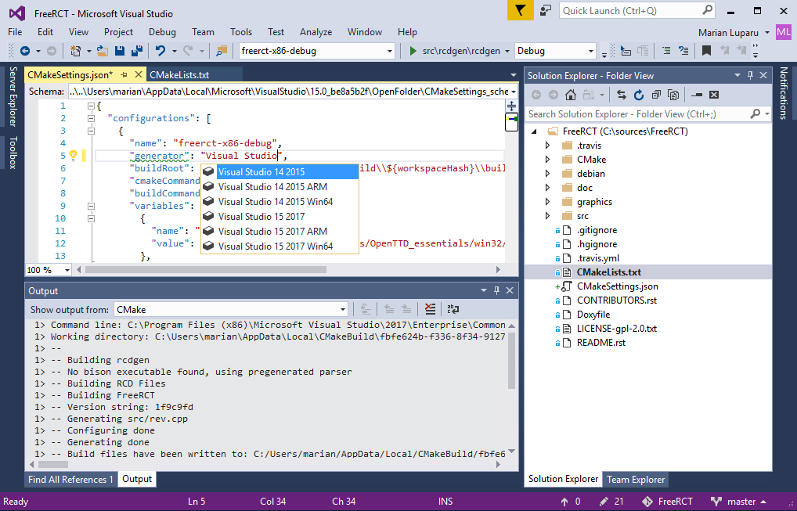
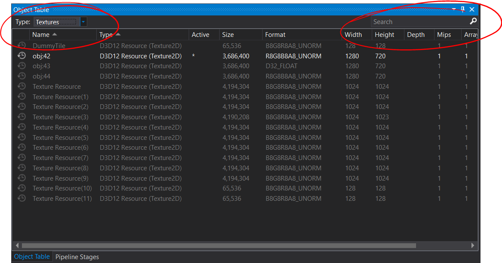
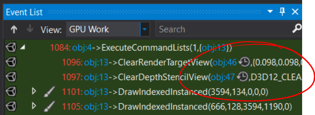
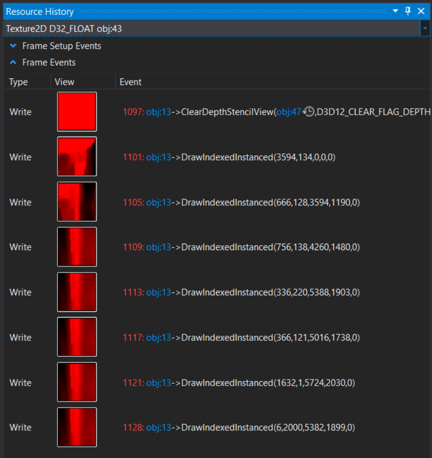
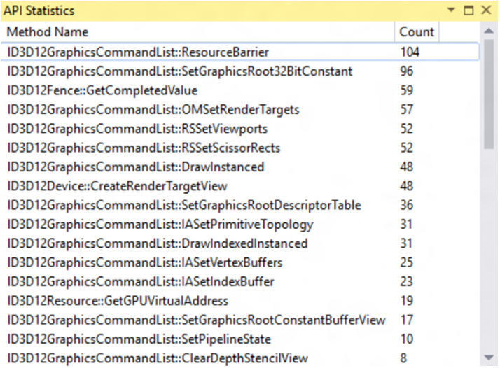
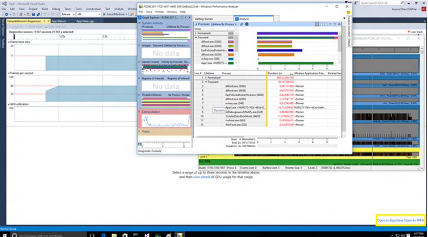
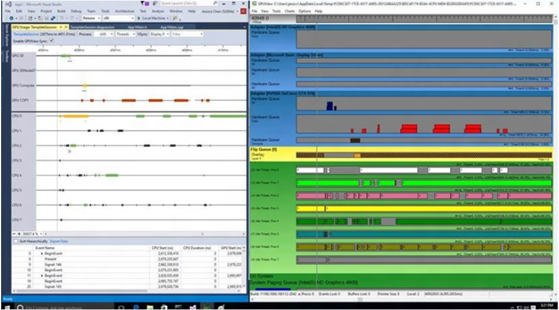

# What's New for Visual C++ in [!INCLUDE[vs_dev15_md](misc/includes/vs_dev15_md.md)]

[!INCLUDE[vs_dev15_md](misc/includes/vs_dev15_md.md)] brings many updates and fixes to the Visual C++ environment. We've fixed over 250 bugs and reported issues in the compiler and tools, many submitted by customers through [Microsoft Connect](https://connect.microsoft.com/VisualStudio "Microsoft Connect"). Thank you for reporting bugs!  For more information on what's new in all of Visual Studio, please visit [What's new in [!INCLUDE[vs_dev15_md](misc/includes/vs_dev15_md.md)]](https://go.microsoft.com/fwlink/?linkid=834481).

The compiler and tools version number in [!INCLUDE[vs_dev15_md](misc/includes/vs_dev15_md.md)] is 14.10.24629. 

## C++ Compiler

### C++ conformance improvements
In this release, we've updated the C++ compiler and standard library with enhanced support for C++11 and C++14 features, as well as preliminary support for certain features expected to be in the C++17 standard. For detailed information, see [C++ Conformance Improvements in Visual Studio 2017](cpp-conformance-improvements-2017.md).

### New compiler switches  

 -**/std:c++14** and **/std:c++latest**: These compiler switches enable you to opt-in to specific versions of the ISO C++ programming language in a project. For more information, see [Standards version switches in the compiler](https://blogs.msdn.microsoft.com/vcblog/2016/06/07/standards-version-switches-in-the-compiler). Most of the new draft standard features are guarded by the /std:c++latest switch. 

-[/permissive-](build/reference/permissive-standards-conformance.md): Enable all strict standards conformance compiler options and disable most Microsoft-specific compiler extensions (but not __declspec(dllimport), for example). (Off by default but will be on by default at some point in the future.)

-[/diagnostics](build/reference/diagnostics-compiler-diagnostic-options.md): Enable display of the line number, the line number and column, or the line number and column and a caret under the line of code where the diagnostic error or warning was found.

-[/debug:fastlink](build/reference/debug-generate-debug-info.md):  
Enable up to 30% faster incremental link times (vs. Visual Studio 2015) by not copying all debug information into the PDB file. The PDB file instead points to the debug information for the object and library files used to create the executable. See [Faster C++ build cycle in VS “15” with /Debug:fastlink](https://blogs.msdn.microsoft.com/vcblog/2016/10/05/faster-c-build-cycle-in-vs-15-with-debugfastlink/) and [Recommendations to speed C++ builds in Visual Studio](https://blogs.msdn.microsoft.com/vcblog/2016/10/26/recommendations-to-speed-c-builds-in-visual-studio/).

[!INCLUDE[vs_dev15_md](misc/includes/vs_dev15_md.md)] allows using /sdl with /await. We removed the /RTC limitation with Coroutines. 

### Codegen, security, diagnostics and versioning
This release brings several improvements in optimization, code generation, toolset versioning and diagnostics. Some notable improvements include:  

- Improved code generation of loops: Support for automatic vectorization of division of constant integers, better identification of memset patterns.
- Improved code security: Improved emission of buffer overrun compiler diagnostics, and /guard:cf now guards switch statements that generate jump tables.
- Versioning: The value of the built-in preprocessor macro _MSC_VER is now being monotonically updated at every Visual C++ toolset update. For more information, see [Visual C++ Compiler Version](https://blogs.msdn.microsoft.com/vcblog/2016/10/05/visual-c-compiler-version/).
- New toolset layout: The compiler and related build tools have a new location and directory structure on your development machine. The new layout enables side-by-side installations of multiple versions of the compiler. For more information, see [Compiler Tools Layout in Visual Studio “15”](https://blogs.msdn.microsoft.com/vcblog/2016/10/07/compiler-tools-layout-in-visual-studio-15/).
- Improved diagnostics: The output window now shows the column where an error occurs. For more information, see [C++ compiler diagnostics improvements in VS “15” Preview 5](https://blogs.msdn.microsoft.com/vcblog/2016/10/05/c-compiler-diagnostics-improvements-in-vs-15-rc/).

## C++ Libraries

### Standard Library improvements:

* Minor basic_string _ITERATOR_DEBUG_LEVEL != 0 diagnostics improvements. Tripping an IDL check in string machinery will now report the specific behavior that caused the trip. For example, instead of "string iterator not dereferencable" you'll get "cannot dereference string iterator because it is out of range (e.g. an end iterator)".
* Performance improvement: made basic_string::find(char) overloads only call traits::find once. Previously this was implemented as a general string search for a string of length 1.
* Performance improvement: basic_string::operator== now checks the string's size before comparing the strings' contents.
* Performance improvement: removed control coupling in basic_string which was difficult for the compiler optimizer to analyze. Resolves VSO# 262848 "<string>: reserve() does too much work". Note that for all short strings, calling reserve still has nonzero cost to do nothing.
* We added \<any\>, \<string_view\>, apply(), make_from_tuple().
* std::vector has been overhauled for correctness and performance: aliasing during insertion/emplacement is now correctly handled as required by the Standard, the strong exception guarantee is now provided when required by the Standard via move_if_noexcept() and other logic, and insertion/emplacement perform fewer element operations.
* The STL now avoids dereferencing null fancy pointers.
* Added \<optional\>, \<variant\>, shared_ptr::weak_type, and \<cstdalign\>.
* Enabled C++14 constexpr in min/max/minmax(initializer_list) and min_element/max_element/minmax_element().
* Improved weak_ptr::lock() performance.
* Fixed std::promise's move assignment operator, which previously could cause code to block forever.
* Fixed compiler errors with atomic\<T \*\>'s implicit conversion to T \*.
* pointer_traits\<Ptr\> now correctly detects Ptr::rebind\<U\>.
* Fixed a missing const qualifier in move_iterator's subtraction operator.
* Fixed silent bad codegen for stateful user-defined allocators requesting propagate_on_container_copy_assignment and propagate_on_container_move_assignment.
* atomic\<T\> now tolerates overloaded operator&().
* To increase compiler throughput, STL headers now avoid including declarations for unnecessary compiler intrinsics.
* Slightly improved compiler diagnostics for incorrect bind() calls.

### Open source library support  
Vcpkg is an open-source command line tool that greatly simplifies the process of acquiring and building open source C++ static libs and DLLS in Visual Studio. For more information, see [Vcpkg updates: Static linking is now available](https://blogs.msdn.microsoft.com/vcblog/2016/11/01/vcpkg-updates-static-linking-is-now-available/).

### CPPRest SDK 2.9.0  
The CPPRestSDK, a cross-platform web API for C++, has been updated to version 2.9.0. For more information, see [CppRestSDK 2.9.0 is available on GitHub](https://blogs.msdn.microsoft.com/vcblog/2016/10/21/cpprestsdk-2-9-0-is-available-on-github/).

## C++ IDE

### Intellisense  
* The new SQLite-based database engine is now being used by default. This will speed up database operations like Go To Definition and Find All References, and will significantly improve initial solution parse time. The setting has been moved to Tools > Options > Text Editor > C/C++ > Advanced (it was formerly under ...C/C++ > Experimental).

* We've improved IntelliSense performance on projects and files not using precompiled headers – an Automatic Precompiled Header will be created for headers in the current file.

* We've added error filtering and help for IntelliSense errors in the error list. Clicking on the error column now allows for filtering. Also, clicking on the specific errors or pressing F1 will launch an online search for the error message.

  

  

* Added the ability to filter Member List items by kind.

  

* Added a new experimental Predictive IntelliSense feature that provides contextually-aware filtering of what appears in the Member List. See [C++ IntelliSense Improvements – Predictive IntelliSense & Filtering](https://blogs.msdn.microsoft.com/vcblog/2016/10/05/c-intellisense-improvements-predictive-intellisense-filtering/)

* Find All References (Shift+F12) now helps you get around easily, even in complex codebases. It provides advanced grouping, filtering, sorting, searching within results, and (for some languages) colorization, so you can get a clear understanding of your references. For C++, the new UI includes information about whether we are reading from or writing to a variable.

* _**New in RC**_ The Dot-to-Arrow IntelliSense feature has been moved from experimental to advanced, and is now enabled by default. The editor features Expand Scopes and Expand Precedence have also been moved from experimental to advanced.

* _**New in RC**_ The experimental refactoring features Change Signature and Extract Function are now available by default.

* _**New in RC**_ We've enabled the new experimental feature for C++ projects ‘Faster project load’. The next time you open a C++ project it will load faster, and the time after that it will load really fast!

Some of these features are common to other languages, and some are specific to C++. For more information about these new features, see [Announcing Visual Studio “15”](https://blogs.msdn.microsoft.com/visualstudio/2016/10/05/announcing-visual-studio-15-preview-5/). 

### Support for non-MSBuild projects with Open Folder
Visual Studio 2017 introduces the “Open Folder” feature, which enables you to code, build and debug in a folder containing source code without the need to create any solutions or projects. This makes it a lot simpler to get started with Visual Studio even if your project is not an MSBuild-based project. With “Open Folder” you get access to the powerful code understanding, editing, building and debugging capabilities that Visual Studio already provides for MSBuild projects. For more information, see [Bring your C++ codebase to Visual Studio with “Open Folder”](https://blogs.msdn.microsoft.com/vcblog/2016/10/05/bring-your-c-codebase-to-visual-studio-with-open-folder/).

* _**New in RC**_ Improvements to the Open Folder experience.     
You can customize the experience through these json files:
  - CppProperties.json to customize the IntelliSense and browsing experience.
  - Tasks.json to customize the build steps. 
  - Launch.json to customize the debugging experience.

### CMake support via Open Folder
Visual Studio 2017 introduces support for using CMake projects without converting to MSBuild project files (.vcxproj). For more information, see [CMake support in Visual Studio](https://blogs.msdn.microsoft.com/vcblog/2016/10/05/cmake-support-in-visual-studio/). Opening CMake projects with “Open Folder” will automatically configure the environment for C++ editing, building and debugging.

* _**New in RC**_ C++ IntelliSense will work without the need to create a CppProperties.json file in the root folder. Along with this, we've added a new dropdown to allow users to easily switch between configurations provided by CMake and CppProperties.json files.

* _**New in RC**_ Further configuration is supported via a CMakeSettings.json file that sits in the same folder as the CMakeLists.txt file.

  

## C++ Installation Workloads 

### Windows Desktop Development with C++:  
We now provide a more granular installation experience for installing the original C++ workload. We have added selectable components that enable you to install just the tools that you need.  Please note that the indicated installation sizes for the components listed in the installer UI are not accurate and underestimate the total size.  

### Linux Development with C++:  
The popular extension [Visual C++ for Linux Development](https://visualstudiogallery.msdn.microsoft.com/725025cf-7067-45c2-8d01-1e0fd359ae6e) is now part of Visual Studio. This installation provides everything you need to develop and debug C++ applications running on a Linux environment.  

### Game Development with C++:  
Use the full power of C++ to build professional games powered by DirectX or Cocos2d.  

### Mobile Development with C++ (Android and iOS):  
You can now create and debug mobile apps using Visual Studio that can target Android and iOS.  

### Universal Windows Apps:  
C++ comes as an optional component for the Universal Windows App workload.  

## New options for C++ on Universal Windows Platform
You now have new options for writing and packaging C++ applications for the Universal Windows Platform and the Windows Store: You can use the Desktop App Converter to package your existing desktop application for deployment through the Windows Store. For more information, see [Using Visual C++ Runtime in Centennial project](https://blogs.msdn.microsoft.com/vcblog/2016/07/07/using-visual-c-runtime-in-centennial-project/) and [Bring your desktop app to the Universal Windows Platform (UWP) with the Desktop Bridge](https://msdn.microsoft.com/en-us/windows/uwp/porting/desktop-to-uwp-root).

When writing new code, you can now use C++/WinRT, a standard C++ language projection for the Windows Runtime implemented solely in header files. It allows you to both author and consume Windows Runtime APIs using any standards-compliant C++ compiler. C++/WinRT is designed to provide C++ developers with first-class access to the modern Windows API. For more information, see [C++/WinRT Available on GitHub](https://moderncpp.com/).

## Clang/C2 Platform Toolset
The Clang/C2 toolset that ships with [!INCLUDE[vs_dev15_md](misc/includes/vs_dev15_md.md)] now supports the /bigobj switch, which is crucial for building large projects. It also includes several important bug fixes, both in the front-end and the back-end of the compiler.

## C++ Code Analysis

The C++ Core Checkers for enforcing the [C++ Core Guidelines](https://github.com/isocpp/CppCoreGuidelines) are now distributed with Visual Studio. Simply enable the checkers in the Code Analysis Extensions dialog in the project's property pages and the extensions will be included when you run code analysis. 

 

## Visual Studio Graphics Diagnostics

Visual Studio Graphics Diagnostics is a set of tools for recording and analyzing rendering and performance problems in Direct3D apps. Graphics Diagnostics features can be used with apps that are running locally on your Windows PC, in a Windows device emulator, or on a remote PC or device.

* **Input & Output for Vertex and Geometry shaders:** The ability to view input and output of vertex shaders and geometry shaders has been one of the most requested features, and it is now supported in the tools. Simply select the VS or GS stage in the Pipeline Stages view to start inspecting its input and output in the table below.

  

* **Search and filter in the object table:** Provides a quick and easy way to find the resources you're looking for.

  
   
* **Resource History:** This new view provides a streamlined way of seeing the entire modification history of a resource as it was used during the rendering of a captured frame. To invoke the history for any resource, simply click the clock icon next to any resource hyperlink.

  

  This will display the new Resource History tool window, populated with the change history of the resource.

  

  Note that if your frame was captured with full call stack capturing enabled (**Visual Studio > Tools > Options > Graphics Diagnostics**), then the context of each change event can be quickly deduced and inspected within your Visual Studio project.  

* **API Statistics:** View a high-level summary of API usage in your frame. This can be handy in discovering calls you may not realize you’re making at all or calls you are making too much. This window is available via **View > API Statistics** in Visual Studio Graphics Analyzer.

  

* **Memory Statistics:** View how much memory the driver is allocating for the resources you create in the frame. This window is available via View->Memory Statistics in Visual Studio Graphics Analyzer. Data can be copied to a CSV file for viewing in a spreadsheet by right clicking and choosing Copy All.

  
 
* **Frame Validation:** The new errors and warnings list provides an easy way to navigate your event list based on potential issues detected by the Direct3D debug layer. Click View->Frame Validation in Visual Studio Graphics Analyzer to open the window. Then click Run Validation to start the analysis. It can take several minutes to complete, depending on the frame's complexity.

  
 
* **Frame Analysis for D3D12:** Use Frame Analysis to analyze draw call performance with directed “what-if” experiments. Switch to the Frame Analysis tab and run analysis to view the report. For more details, watch the [GoingNative 25: Visual Studio Graphics Frame Analysis](https://channel9.msdn.com/Shows/C9-GoingNative/GoingNative-25-Offline-Analysis-Graphics-Tool) video.

  

* **GPU Usage Improvements:** Open traces taken via the Visual Studio GPU Usage profiler with either GPU View or the Windows Performance Analyzer (WPA) tool for more detailed analysis. If you have the Windows Performance Toolkit installed there will be two hyperlinks, one for WPA and other for GPU View, at the bottom right of the session overview.

  
 
  Traces opened in GPU View via this link support synchronized zooming and panning in the timeline between VS and GPU View. A checkbox in VS is used to control whether synchronization is enabled or not. 

   

 

<!--HONumber=Jan17_HO2-->

