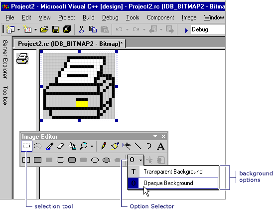

# Choosing a Transparent or Opaque Background (Image Editor for Icons)
When you move or copy a selection from an image, any pixels in the selection that match the current background color are, by default, transparent; they do not obscure pixels in the target location.  
  
 You can switch from a transparent background (the default) to an opaque background, and back again. When you use a selection tool, the **Transparent Background** and **Opaque Background** options appear in the Option selector on the **Image Editor** toolbar (as seen below).  
  
   
Transparent and Opaque Options on the Image Editor Toolbar  
  
### To switch between a transparent and opaque background  
  
1.  In the **Image Editor** toolbar, click the **Option** selector, and then click the appropriate background:  
  
    -   **Opaque Background (O)**: Existing image is obscured by all parts of the selection.  
  
    -   **Transparent Background (T)**: Existing image shows through parts of the selection that match the current background color.  
  
 \- or -  
  
-   On the **Image** menu, select or clear **Draw Opaque**.  
  
 You can change the background color while a selection is already in effect to change which parts of the image are transparent.  
  
 For information on adding resources to managed projects, please see [Resources in Applications](http://msdn.microsoft.com/Library/8ad495d4-2941-40cf-bf64-e82e85825890) in the *.NET Framework Developer's Guide.* For information on manually adding resource files to managed projects, accessing resources, displaying static resources, and assigning resources strings to properties, see [Walkthrough: Localizing Windows Forms](http://msdn.microsoft.com/en-us/9a96220d-a19b-4de0-9f48-01e5d82679e5) and [Walkthrough: Using Resources for Localization with ASP.NET](http://msdn.microsoft.com/Library/bb4e5b44-e2b0-48ab-bbe9-609fb33900b6).  
  
 Requirements  
  
 None  
  
## See Also  
 [Accelerator Keys](../mfc/accelerator-keys-image-editor-for-icons.md)   
 [Working with Color](../mfc/working-with-color-image-editor-for-icons.md)

<!--HONumber=Jan17_HO1-->

